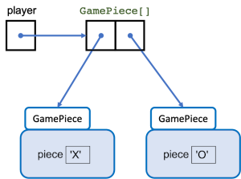
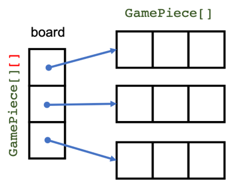
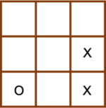
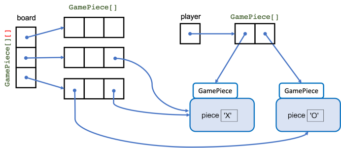

# Recitation 8 - Tic Tac Toe

A Tic Tac Toe board is composed of a 3 x 3 square board.  Two players play the 
game, each having his/her/its game piece.  The traditional game pieces are Xs 
and Os; however, they do not need to be.  The game begins with player one 
choosing one of the nine squares.  Once player one chooses, player one's game 
piece will occupy that square.  Then player two selects one of the remaining 
squares and places his/her/its game piece in that square.  The selection 
continues alternating between player one and player two until one of the 
following occurs:

1. One of the players has his/her/its game piece on the three horizontal or 
   vertical squares or along the center diagonal squares.  In that case, 
   the player whose game pieces satisfy this condition is the winner.
2. All squares are occupied, and condition 1 is not satisfied.  In that 
   case, the game ends in a draw.
   

In this recitation exercise, you will implement a Tic Tac Toe board in a class 
called TicTacTac, which will be used in a class called TicTacToeGame.  Since 
a game consists of game pieces, a class called GamePiece is already implemented. While
this may seem like a useless class, you need only think about how this can 
be easily extended, for example, to implement on Greenfoot.

## The GamePiece Class
The GamePiece class is a a simple class that uses characters as the basis of the 
game piece; however, it is straight forward to extend this to, for example, 
an Actor based game piece in Greenfoot.  Take a look at the class and become
familiar with its behavior.

## The TicTacToe Class
This is the implementation of the Tic Tac Toe board.  You will be required to implement
several of the methods in the TicTacToe class.  The underlying array representing the 
board could have been implemented using a 1-dimensional array of length nine, or a 
3 x 3 2-dimensional array.  This recitation uses the latter representation.

The TicTacToe class declares a field called player, which is an array 
of two GamePiece type, representing the game pieces of
player one and two.

```java
private GamePiece[] player;
```
and defined in the constructor as,

```java
player = new GamePiece[2];
player[0] = new GamePiece(p1);
player[1] = new GamePiece(p2);
```
where p1 and p2 are game pieces.  Diagramatically, this may look like,



The TicTacToe class declares a field,

```java
private GamePiece[][] board;
```

and defines the array in the constructor as,

```java
board = new GamePiece[3][3];
```

Digramatically, this will look like,



When a game piece occupies a board position, we will represent this by assigning a reference to 
one of the game pieces referred to in the `player` array.

So, a board that looks like the following,



is represented at runtime in the following diagram.



## Submission

You are required to implement the following methods in the TicTacToe class.

1. isValid()
2. isEmpty()
3. movesRemaining()
4. getPiece()
6. getCurrentPlayer()
7. clear()

A unit test is provided on which to test these methods.

## Recitation Activities

The toString() method and the getWinner() method will be implemented during recitation.  You
will also be given instructions on how to set up the run configuration to run a complete
two-person game using the TicTacToeGame class..
